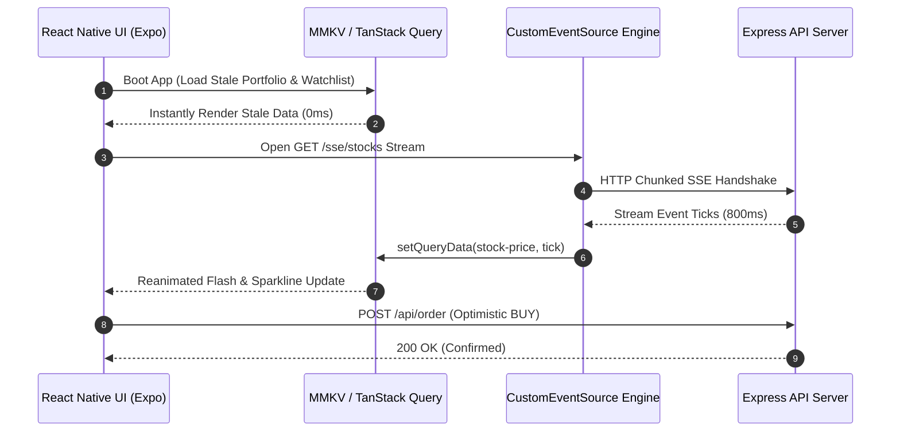

# 🚀 High-Frequency Stock Trading & Portfolio Dashboard

A production-grade, real-time React Native (Expo) stock trading platform built with **TanStack Query v5**, **MMKV**, **Reanimated**, and **Server-Sent Events (SSE)**.

---

## 🌟 Key Architecture & Technical Highlights

### ⚡ Phase 1: MMKV Persistence & Offline Boot
- **Fast Local Disk Storage**: Utilizes `react-native-mmkv` with `@tanstack/react-query-persist-client` and `createSyncStoragePersister`.
- **Instant Stale Load**: Serves cached watchlist and portfolio data instantly on boot before SSE socket connection establishes.
- **Graceful Fallback**: Custom memory-storage wrapper ensures zero crashes when running in web or Expo Go environments.

### 🔄 Phase 2: Optimistic Order Execution & State Rollback
- **Optimistic Mutation**: Custom `useOrderExecution` hook built on TanStack Query's `useMutation`.
- **Snapshot & Rollback**: Implements `onMutate` cache snapshotting. Instantly updates portfolio cash balance and share holdings on order placement. Automatically rolls back state upon network failure (`onError`).

### 📈 Phase 3: High-Frequency SSE Engine & Sparkline Charts
- **Hermes-Compatible EventSource**: Native `CustomEventSource` streaming engine built with chunked `XMLHttpRequest` stream buffering. Avoids Node/Hermes `Event` global reference crashes.
- **Live Sparkline Charts**: High-performance SVG sparkline rendering (`react-native-svg`) with 20-tick sliding window cache buffers.
- **Reanimated Price Flash Overlay**: `react-native-reanimated` color sequence highlights (`rgba(16, 185, 129, 0.3)` / `rgba(239, 68, 68, 0.3)`) on live price updates.

### 💼 Portfolio Net Worth & Asset Allocation
- **Real-Time Net Worth**: Dynamically calculates total net worth (`Cash + Live Valuation of Holdings`) updated live on every SSE tick.
- **Multi-Color Asset Allocation Bar**: Displays visual percentage breakdown across Cash, AAPL, GOOGL, TSLA, and MSFT.

### 🕒 Market Sessions & Network Health Banner
- **Session Modes**: Support for `Regular Hours`, `Pre-Market`, `After-Hours`, and `24/7 Demo` volatility modes.
- **Network Health Banner**: Live banner alerts user of SSE stream reconnect attempts.
- **Ticker Search & Filter**: Real-time Watchlist search input.

---

## 📊 System Sequence Diagram



---

## 🛠️ Installation & Setup

### 1. Start Mock Backend Server
```bash
cd stock-backend
npm install
node server.js
```

### 2. Start Expo App
```bash
cd StockDashboard
npm install
npx expo start -c
```