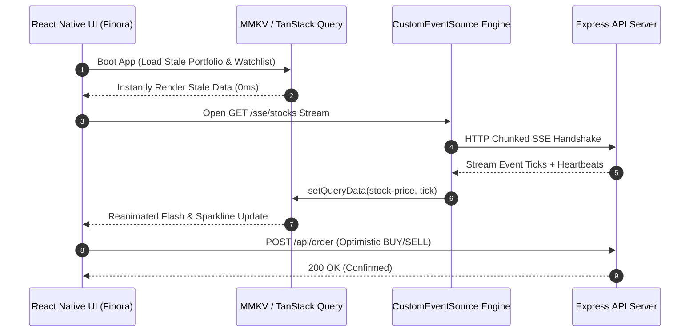

# 📈 Finora — Real-Time Stock Trading & Portfolio Dashboard

A production-grade, real-time React Native (Expo) stock trading platform built with **TanStack Query v5**, **MMKV Storage**, **Reanimated**, and **Server-Sent Events (SSE)**.


---

## 🔗 Live Production Demos

| Environment | URL | Status |
|---|---|---|
| 🌐 **Live Web Application (Vercel)** | [finora-omega-wheat.vercel.app](https://finora-omega-wheat.vercel.app) | 🟢 Live |
| ⚡ **Live Streaming Backend (Render)** | [finora-stock-backend.onrender.com](https://finora-stock-backend.onrender.com) | 🟢 Live |

---

## 🌟 Architecture & Features

### ⚡ Phase 1: MMKV Persistence & Offline Boot
- **Fast Local Disk Storage**: Utilizes `react-native-mmkv` with `@tanstack/react-query-persist-client` and `createSyncStoragePersister`.
- **Instant Stale Load**: Serves cached watchlist and portfolio data instantly on boot before SSE socket connection establishes.
- **Cross-Platform Storage Engine**: Custom memory-storage wrapper ensures zero crashes when running in web or Expo Go environments.

### 🔄 Phase 2: Optimistic Order Execution & State Rollback
- **Optimistic Mutation**: Custom `useOrderExecution` hook built on TanStack Query's `useMutation`.
- **Snapshot & Rollback**: Implements `onMutate` cache snapshotting. Instantly updates portfolio cash balance and share holdings on order placement. Automatically rolls back state upon network failure (`onError`).

### 📈 Phase 3: High-Frequency SSE Engine & Sparkline Charts
- **Hermes-Compatible EventSource**: Native `CustomEventSource` streaming engine built with chunked `XMLHttpRequest` stream buffering. Prevents Node/Hermes global reference crashes.
- **Live Sparkline & Analytics Charts**: High-performance SVG sparkline rendering (`react-native-svg`) with 20-tick sliding window cache buffers and detailed time-series analysis (1D, 1W, 1M, 1Y).
- **Reanimated Price Flash Overlay**: `react-native-reanimated` color sequence highlights (`rgba(16, 185, 129, 0.3)` / `rgba(239, 68, 68, 0.3)`) on live price ticks.

### 💼 Portfolio Net Worth & Asset Allocation
- **Real-Time Net Worth**: Dynamically calculates total net worth (`Cash + Live Valuation of Holdings`) updated live on every SSE tick.
- **Multi-Color Asset Allocation Bar**: Displays visual percentage breakdown across Cash, AAPL, GOOGL, TSLA, and MSFT.

### 🎨 Modern UI & Edge-to-Edge System Bar Polish
- **Fintech Branding & Splash Screen**: Custom animated splash screen with centered logo, smooth transitions, and custom app icon.
- **Edge-to-Edge Android Insets**: Full native status bar and navigation bar integration with safe area insets.
- **Responsive Layout**: Constrained max-width container (`680px`) for seamless desktop/web and mobile rendering.

---

## 📊 System Sequence Diagram



---

## 🛠️ Local Installation & Development

### 1. Clone & Install Dependencies
```bash
git clone https://github.com/Subramanya2/react-native-stock-dashboard.git
cd react-native-stock-dashboard
```

### 2. Start Backend API Server
```bash
cd stock-backend
npm install
npm start
```
*Backend runs on `http://localhost:8080`*

### 3. Start Expo App (Frontend)
```bash
cd ../StockDashboard
npm install
npx expo start -c
```
*Press `w` for Web or scan the QR code with **Expo Go** (Android/iOS).*

---

## 🔑 Environment Variables

| Variable | Scope | Required? | Production Value | Description |
|---|---|---|---|---|
| `PORT` | `stock-backend` | Optional | `8080` | Backend port. Render sets this automatically. |
| `EXPO_PUBLIC_API_URL` | `StockDashboard` | **Yes (Prod)** | `https://finora-stock-backend.onrender.com` | Live production backend URL. |

---

## 🚀 Production Deployment

### 🌐 Deploy Backend to Render
1. Create a **Web Service** on [Render](https://dashboard.render.com/).
2. Root Directory: `stock-backend`
3. Build Command: `npm install` | Start Command: `npm start`
4. Deployed Endpoint: `https://finora-stock-backend.onrender.com`

### ⚡ Deploy Frontend to Vercel
1. Import repository on [Vercel](https://vercel.com/new).
2. Root Directory: `StockDashboard`
3. Environment Variable: `EXPO_PUBLIC_API_URL` = `https://finora-stock-backend.onrender.com`
4. Deployed URL: `https://finora-omega-wheat.vercel.app`

### 📱 Build Android Preview APK
```bash
cd StockDashboard
eas build --platform android --profile preview
```