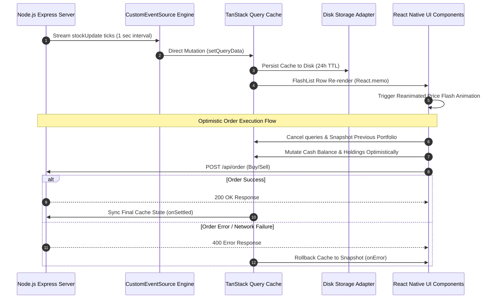

# 📈 Real-Time Stock Trading & Portfolio Dashboard

A high-performance **React Native (Expo)** mobile & web trading dashboard engineered for low-latency market streaming, optimistic order execution, persistent query caching, and interactive financial charts.

---

## 🛠️ Architecture & System Data Flow



---

## ⚡ Technical Highlights & Resume Features

* **Real-Time Streaming Engine**: Custom zero-dependency [`CustomEventSource`](file:///d:/cv-projects/StockAssignment/StockDashboard/services/eventSource.ts) handling Server-Sent Events (SSE) via `XMLHttpRequest` chunked streaming on mobile and native `EventSource` on Web, featuring **exponential backoff reconnection logic**.
* **Optimistic Order Execution with Rollback**: Custom [`useOrderExecution`](file:///d:/cv-projects/StockAssignment/StockDashboard/hooks/useOrderExecution.ts) hook that instantly recalculates cash balance & portfolio holdings in the query cache upon placing an order, automatically rolling back on failure (`onMutate` -> `onError` -> `onSettled`).
* **Offline Query Persistence**: Integrated `PersistQueryClientProvider` with synchronous [`storage.ts`](file:///d:/cv-projects/StockAssignment/StockDashboard/services/storage.ts) adapter for instant application boot from disk before network connection.
* **Interactive Stock Detail & Timeframe Charts**: Dynamic dynamic route [`app/stock/[symbol].tsx`](file:///d:/cv-projects/StockAssignment/StockDashboard/app/stock/%5Bsymbol%5D.tsx) with interactive SVG area charts, timeframe filter buttons (`1D`, `1W`, `1M`, `1Y`), and market statistics grid.
* **Reanimated Live Price Flashes**: `react-native-reanimated` color sequence animations flashing green/red on price update ticks.
* **Virtualized List Scaling**: Powered by `@shopify/flash-list` and strict `React.memo` row memoization to prevent main-thread layout thrashing.
* **Dynamic Host Resolution**: Cross-environment IP resolver [`getApiBaseUrl()`](file:///d:/cv-projects/StockAssignment/StockDashboard/api/stockApi.ts) supporting Android Emulators (`10.0.2.2`), iOS Simulators, Physical Devices via Expo `hostUri`, and Web.

---

## 🚀 Tech Stack

* **Frontend Framework**: React Native, Expo SDK 54, Expo Router v6
* **Language**: TypeScript (Strict Mode)
* **Data Fetching & Cache**: TanStack Query v5 (React Query)
* **Offline Storage**: `react-native-mmkv` with cross-platform fallback
* **Global UI State**: Zustand
* **List Virtualization**: `@shopify/flash-list`
* **Animations**: `react-native-reanimated`
* **Charts & Graphics**: `react-native-svg`
* **Backend**: Node.js, Express v5, CORS, Server-Sent Events

---

## 🏁 How to Run

### 1. Start the Backend Server

```bash
cd stock-backend
npm install
node server.js
# Server runs at http://localhost:8080
```

### 2. Start the Expo Application

```bash
cd StockDashboard
npm install
npx expo start -c
```

* **Web**: Press `w` in terminal to run in web browser.
* **Mobile (Expo Go)**: Scan the generated QR code using your iOS or Android camera / Expo Go app.

---

## 🧪 Unit Testing

```bash
cd StockDashboard
npm test
```